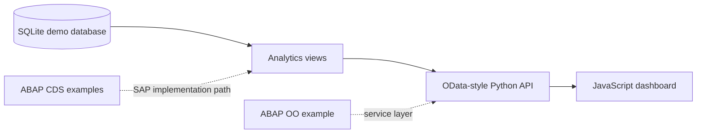

# SAP-Inspired Fleet Maintenance Service

An original full-stack portfolio project inspired by the requirements of a real **Junior SAP ABAP/UI5 Developer** vacancy at Mobil ISC. The role mentions ABAP/ABAP OO, OData, CDS Views, HANA SQLScript, JavaScript, SAP UI5 and BI/Cross Application development.

**Vacancy reference:** [Junior SAP ABAP/UI5 Developer — Mobil ISC](https://devjobs.de/job/1cba699e8ce283ce8d1fdd0f626f16a9)

> This independent learning project uses fictional data and does not claim implementation inside a productive SAP system. The local API reproduces selected OData-style concepts; the CDS and ABAP files are documented examples for an SAP practice environment.

## Business case

A regional transport company needs one view of its vehicle maintenance operations. Dispatchers must identify overdue work orders, workshop workload, maintenance cost and recurring faults before vehicles return to service.

## What the project demonstrates

- Relational modelling for a cross-application business process
- Analytical SQL, CTEs, window functions and data-quality controls
- A read-only JSON API with OData-style `$filter`, `$select`, `$orderby` and `$top` options
- A small JavaScript dashboard consuming the API
- ABAP CDS view entity examples
- An ABAP OO service-class example
- Automated API and data tests

## Architecture



## Run the project

Python 3.10+ is required. No third-party packages are needed.

```bash
python app.py
```

Then open [http://localhost:8000](http://localhost:8000).

Run the automated tests with:

```bash
python -m unittest discover -s tests
```

## Example endpoints

```text
/api/WorkOrders?$top=5
/api/WorkOrders?$filter=status eq 'OPEN'
/api/WorkOrders?$select=work_order_id,vehicle_code,status
/api/WorkOrders?$orderby=estimated_cost desc
/api/KPIs
```

## Repository structure

```text
sql/        Schema, seed data and analytical queries
web/        Browser dashboard
sap/        ABAP CDS and ABAP OO examples
tests/      Automated tests
docs/       Requirement mapping and findings
app.py      Local API and web server
```

## Skills-to-vacancy mapping

| Vacancy requirement | Evidence in this repository |
|---|---|
| HANA SQLScript / data work | Analytical queries, CTEs, window functions and controls |
| OData services | Queryable read-only API with documented OData-style parameters |
| JavaScript / UI development | Responsive dashboard consuming live API data |
| CDS Views | Interface and consumption view examples in `sap/` |
| ABAP OO | Repository/service class example with clear responsibilities |
| BI / Cross Application | KPIs combine maintenance, vehicle and workshop data |

## License

MIT

